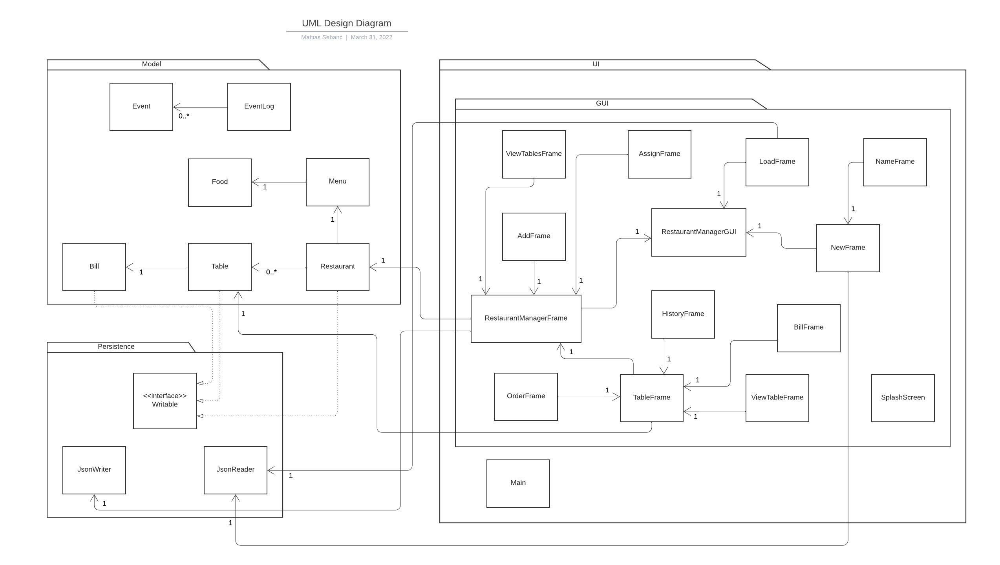

# Restaurant Manager 

### By Mattias Sebanc

### Project Proposal

**_Application Features:_**

###### In this application, users will be able to:

- Control amount of tables in the restaurant
- Check and set table status (such as clean, unclean, set, and occupied)
- Assign customers of varying sizes to unoccupied tables that fit the party size
- Take customers' orders and record when food/drinks was delivered
- Keep track of the bill with the correct amount needed to be paid

**_Users_**

###### This application will be used by:

- Restaurant Managers: to keep track of tables
- Restaurant Waiters: to keep track of customer orders

**_Interest_**

###### This application is of interest to me because:

- It has fascinated me how waiters are able to keep track of all the moving parts of a restaurant
- I wanted to code a program that would do exactly that, keep track of tables and customers
- I thought it would be interesting to combine a budget tracking program with a program that keeps track of items
- Because of the pandemic, I wanted to make a program that keeps track of cleaning status as that is relevant to the
  times

### User Stories

- As a user, I want to add tables of different sizes to my restaurant
- As a user, I want to remove tables of different sizes from my restaurant
- As a user, I want to check if the tables are clean/set and clean/set them if they are not
- As a user, I want to check the history of when tables were cleaned
- As a user, I want to assign varying party sizes to the tables where they fit
- As a user, I want to take customers' drink and food orders when needed
- As a user, I want to record when the food and drinks were delivered
- As a user, I want to bill customers when needed and keep track of when it was paid
- As a user, I want to be able to save up to 5 of my restaurants along with all of its tables to file
- As a user, I want to be able to load up to 5 of my restaurant along with all of its tables from file

### Phase 4: Task 2
###### Event Log Representable Sample:
    Sun Mar 27 21:50:50 PDT 2022
    Added Table 1 to Log Test Restaurant
    Sun Mar 27 21:50:59 PDT 2022
    Added Table 2 to Log Test Restaurant
    Sun Mar 27 21:51:11 PDT 2022
    Added Table 3 to Log Test Restaurant
    Sun Mar 27 21:51:18 PDT 2022
    Added Table 4 to Log Test Restaurant
    Sun Mar 27 21:51:27 PDT 2022
    Added Table 5 to Log Test Restaurant
    Sun Mar 27 21:51:38 PDT 2022
    Removed Table 5 from Log Test Restaurant
    Sun Mar 27 21:51:42 PDT 2022
    Removed Table 4 from Log Test Restaurant
    Sun Mar 27 21:51:47 PDT 2022
    Removed Table 3 from Log Test Restaurant
    Sun Mar 27 21:51:57 PDT 2022
    Added Table 3 to Log Test Restaurant

### Phase 4: Task 3
###### UML Class Diagram:

###### Reflection On Diagram:
- When I was working on my UML Class Diagram in the GUI package, I noticed how many similar associations there was to 
the same class. For example, the TableFrame class has four classes with an association of multiplicity of 1 to it. So,
I looked at those classes and noticed that they are all very similar. If I had more time, to improve the design of my 
code, I would create an abstract frame class to cut down the number of associations to just one class. This would make 
the code easier to follow and the UML diagram would be easier to read. I did not utilize hierarchies in my code enough 
and my design would benefit from it. Also, some classes may be able to be combined into one class if I had more time to 
figure that out. That would also make my code and UML class diagram more readable. Apart from that, there isn't much 
more refactoring that needs to be done.

